title: 使用 GithubActions 打造免费个人运动主页
date: 2025-03-14 12:30:46
categories: Personal
tags: [GithubActions,GithubPages]
---
> 利用 Github Actioins & Github Pages 打造个人运动主页
>
> 我的个人运动主页：[https://anchenspp.github.io/running_page/](https://anchenspp.github.io/running_page/)

<!--more-->

### 缘起
每到年末岁尾，各大平台都会推出年度总结，对于刚入坑越野跑的我，自然很关心我过去一年的数据。我平时使用的是 coros pace2 watch + strava app，coros 和 strava 都给了我一份年度报告，如下：


偶然闲逛小红书 🍠，看到了更加有趣的报告，可以把跑步的轨迹做成海报，这像不像是一种记录跑者的象形文字，如下：


搜了下，网上有 3 个工具可以生成上述的效果图，对比如下：

| **** | **runalyze**                                                     | **dashclip**                                                                                               | **running_page**                                                                         |
| --- |------------------------------------------------------------------|------------------------------------------------------------------------------------------------------------|------------------------------------------------------------------------------------------|
| **链接** | [https://runalyze.com/dashboard](https://runalyze.com/dashboard) | [https://apps.apple.com/lu/app/dashclip/id6479593003](https://apps.apple.com/lu/app/dashclip/id6479593003) | [https://github.com/yihong0618/running_page](https://github.com/yihong0618/running_page) |
| **是否免费** | 免费（高级功能收费）                                                       | 免费（高级功能收费）                                                                                                 | 免费（开源）                                                                                   |
| **特点&优势** | 专业分析                                                             | 轻量级、手机 app                                                                                                 | 公开访问、自动同步                                                                                |
| **截图** | 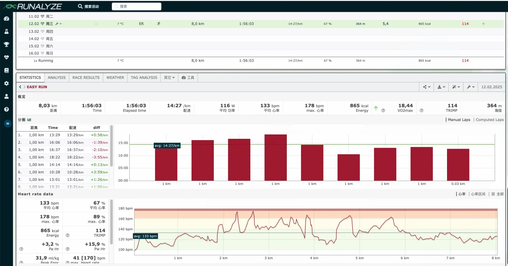                      |                                                                 | 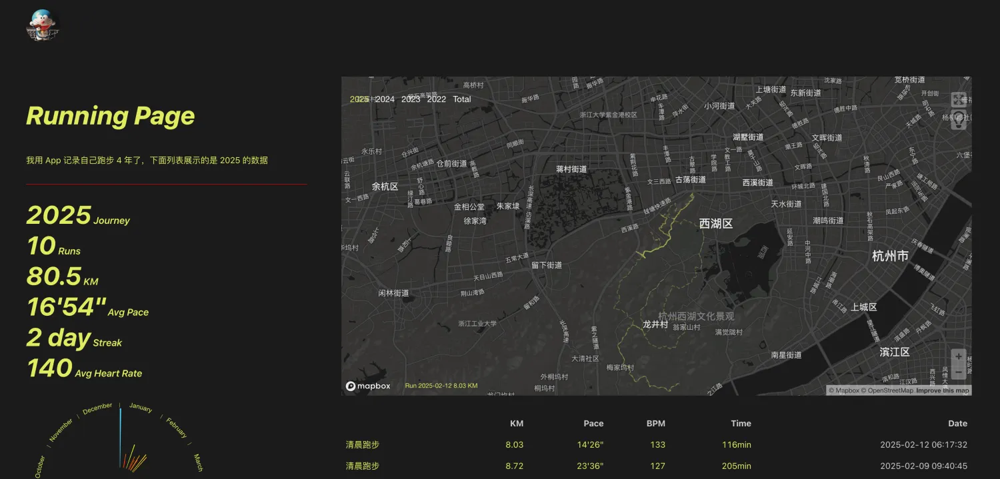                                          |


最终决定使用 running_page，通过 Github actions & Github pages 打造免费个人运动主页。

### 实现过程
#### Fork 项目
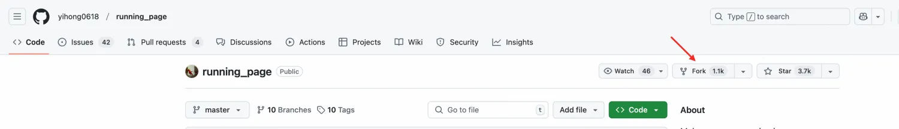

我的仓库地址：[https://github.com/anchenspp/running_page](https://github.com/anchenspp/running_page)

#### 环境配置
<font style="color:rgb(25, 27, 31);">将项目 clone 到本地</font>

```shell
git clone https://github.com/xxxx/running_page.git --depth=1
```

<font style="color:rgb(25, 27, 31);">安装及测试 (node >= 16 python >= 3.8)</font>

```shell
pip3 install -r requirements.txt
npm install -g corepack && corepack enable && pnpm install
pnpm develop
```

<font style="color:rgb(25, 27, 31);">访问 http://localhost:5173/ 查看效果</font>

#### <font style="color:rgb(25, 27, 31);">个性化配置</font>
<font style="color:rgb(25, 27, 31);">在仓库目录下找到 src/static/site-metadata.ts，找到以下内容并修改成你自己想要的：</font>

```shell
siteMetadata: {
  siteTitle: 'Running Page', #网站标题
  siteUrl: 'https://yihong.run', #网站域名
  logo: 'https://encrypted-tbn0.gstatic.com/images?q=tbn:ANd9GcQTtc69JxHNcmN1ETpMUX4dozAgAN6iPjWalQ&usqp=CAU', #左上角 LOGO
  description: 'Personal site and blog',
  navLinks: [
    {
      name: 'Blog', #右上角导航名称
      url: 'https://yihong.run/running', #右上角导航链接
    },
    {
      name: 'About',
      url: 'https://github.com/yihong0618/running_page/blob/master/README-CN.md',
    },
  ],
},
```

#### 数据下载
以 coros 为例，获取数据命令为：

```shell
python run_page/coros_sync.py 'your coros account' 'your coros password'
```

#### 同步配置
<font style="color:rgb(25, 27, 31);">在仓库目录下找到 .github/workflows/run_data_sync.yml，修改同步配置：</font>

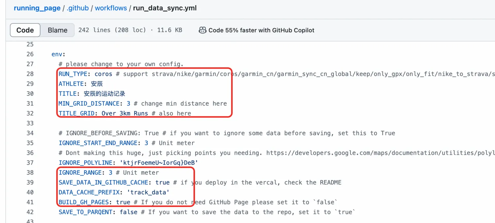

#### 提交代码
```shell
git add .
git commit -m "update"
git push
```

#### 部署 & 定时同步
<font style="color:rgb(25, 27, 31);">进入仓库的 Settings -> GitHub Pages -> Source，选择 "GitHub Actions"</font>

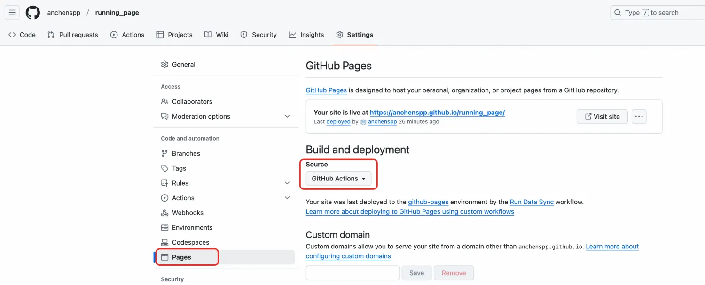

<font style="color:rgb(25, 27, 31);">为 GitHub Actions 添加代码提交权限，访问仓库的 Settings > Actions > General页面，找到 Workflow permissions 的设置项，将选项配置为 Read and write permissions，支持 CI 将运动数据更新后提交到仓库中</font>

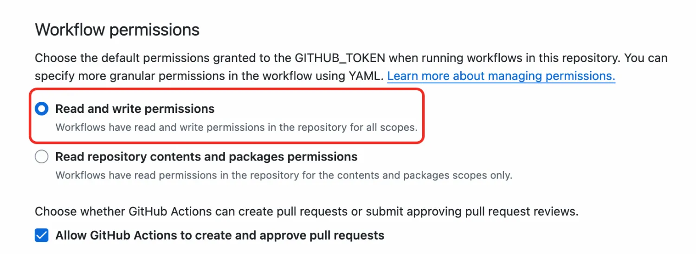

<font style="color:rgb(25, 27, 31);">访问仓库的 Settings > Security > Secrets and variables > Actions 页面，添加 coros 账号及密钥信息</font>

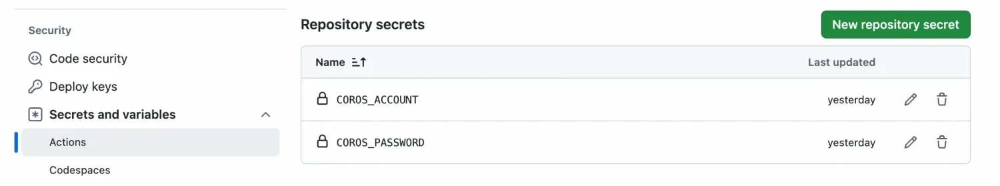

<font style="color:rgb(25, 27, 31);">点击 "Run Data Sync" 更新数据，触发 "Publish GitHub Pages" 工作流</font>

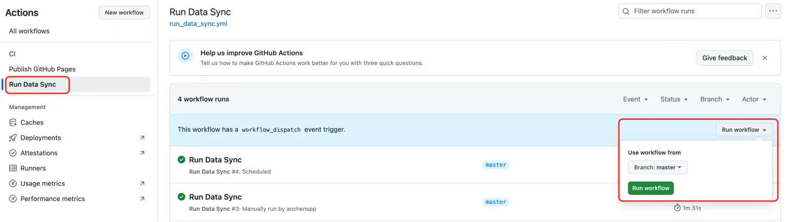

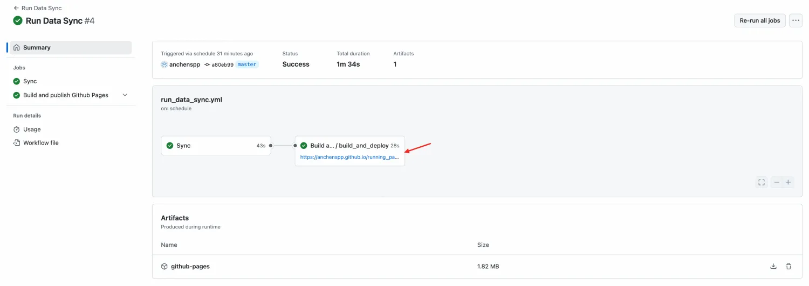

同步任务支持手工触发，也支持定时触发

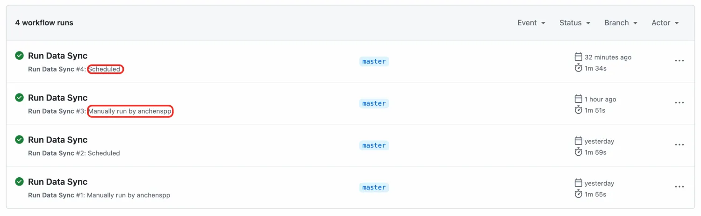

#### 效果


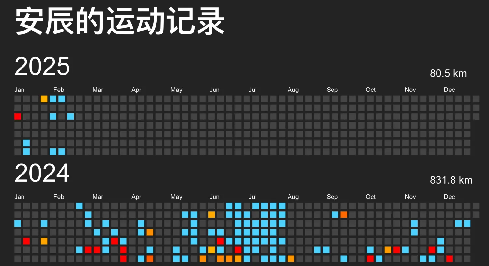

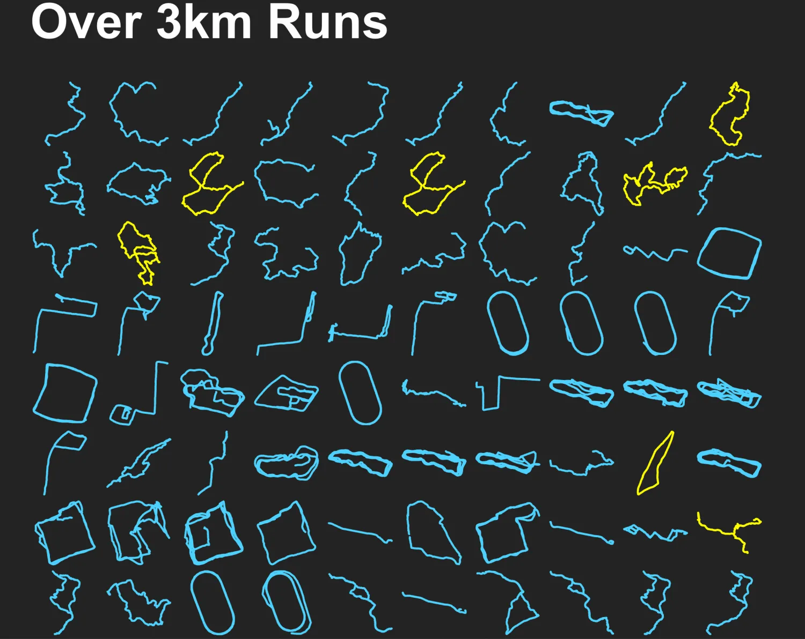

### 原理
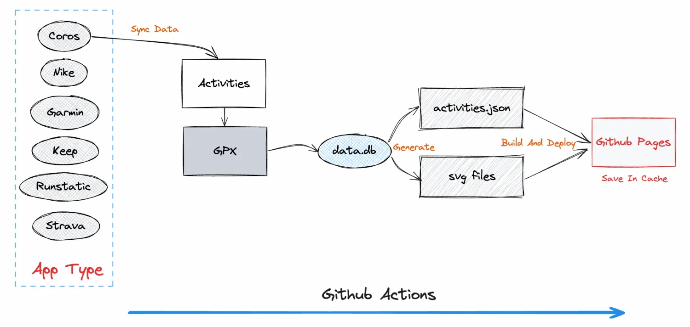


> 1. <font style="color:rgb(31, 35, 40);">GitHub Actions 自动同步跑步数据，生成展示页面</font>
> 2. <font style="color:rgb(25, 27, 31);">Gatsby 生成的</font>静态网页<font style="color:rgb(25, 27, 31);">，速度快</font>
> 3. <font style="color:rgb(31, 35, 40);">支持 GitHub Pages 自动部署</font>
> 4. <font style="color:rgb(31, 35, 40);">React Hooks</font>
> 5. <font style="color:rgb(31, 35, 40);">Mapbox 进行地图展示</font>
> 6. <font style="color:rgb(31, 35, 40);">Nike、Strava、佳明（佳明中国）及 Keep 等，自动备份 GPX 数据，方便备份及上传到其它软件</font>
>
> 因为数据存在 gpx 和 data.db 中，理论上支持几个软件一起，你可以把之前各类 App 的数据都同步到这里（建议本地同步，之后 Actions 选择正在用的 App）
>


Github Actions Job 示例

[https://github.com/anchenspp/running_page/actions/runs/13276073371/job/37065801672](https://github.com/anchenspp/running_page/actions/runs/13276073371/job/37065801672)


Commit 示例

[https://github.com/anchenspp/running_page/commit/3e51907993f62ff53988279cdd91143171456e72#diff-45cd37dc7670a2ca7f85ada88010c57418f9db57b2cebb401ce36435082f043f](https://github.com/anchenspp/running_page/commit/3e51907993f62ff53988279cdd91143171456e72#diff-45cd37dc7670a2ca7f85ada88010c57418f9db57b2cebb401ce36435082f043f)

### 写在最后
整个搭建过程差不多耗时 20 分钟，除了部署的时候遇到了几个坑之外，其他都很顺利，有兴趣的同学可以试试，这件事在我看来还是很有趣很酷的。

### 参考
【1】[https://github.com/yihong0618/running_page](https://github.com/yihong0618/running_page)

