title: 快来领取你的免费“AI 每日新闻”
date: 2025-06-05 12:30:46
categories: Personal
tags: [GithubActions,Vercel,AI,RSS]
---
> <font style="color:rgb(31, 35, 40);">基于 RSS 地址，每天定时采集一次前一天的内容，通过 GPT 进行分析总结，形成一份每日报告，</font>利用 Github Actioins & Vercel <font style="color:rgb(31, 35, 40);">一键部署独属于你的每日新闻总览,支持 OpenAI、Gemini Pro、Qwen3 模型。</font>
>
> 我的每日新闻主页：[https://ai.anchen.me/](https://ai.anchen.me/)
>

<!--more-->

<h3 id="GW1td">缘起</h3>
AI 就像一场风暴，从最初的 ChatGPT，到 Copilot RAG，到 Workflow Agent，到 Cursor，再到 Devin，发展的速度之快，日新月异，需要时刻关注业界的新技术、新方向，靠人肉每天吭哧吭哧去搜集信息已经不能满足需求了，所以在想，是否可以用自动化的方式去搜集信息，通过 AI 去分析总结，形成一份报告。


搜了下，网上有个开源工具可以满足我的诉求：[https://github.com/zhangferry/AIDailyNews](https://github.com/zhangferry/AIDailyNews)

<h3 id="UL7ED">实现过程</h3>
<h4 id="AqH0p">Fork 项目</h4>
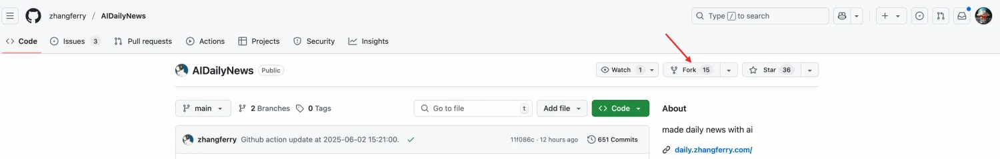

我的仓库地址：[https://github.com/hellomypastor/daily-news](https://github.com/hellomypastor/daily-news)

<h4 id="XnX8O"><font style="color:rgb(25, 27, 31);">个性化配置</font></h4>
<font style="color:rgb(25, 27, 31);">在仓库目录下找到 workflow/resources/rss.json，找到以下内容并修改成你自己想要的：</font>

```json
{
  "configuration": {
    "rsshub_domain": "https://rsshub.zhangferry.com/"
  },
  "categories": [
    {
      "category": "\uD83E\uDD16 AI News",
      "items": [
        {
          "title": "oneminute_daily_ai_news RSS",
          "url": "https://www.reddit.com/user/Excellent-Target-847/.rss",
          "type": "link",
          "output_count": 1
        },
        {
          "title": "Hacker News - AI",
          "url": "https://hnrss.org/newest?q=AI",
          "type": "link",
          "output_count": 3
        },
        {
          "title": "36Kr",
          "url": "https://rss.aishort.top/?type=36kr",
          "output_count": 1
        },
        {
          "title": "AIShort",
          "url": "https://rss.aishort.top/?type=wasi",
          "type": "link",
          "output_count": 0
        }
      ]
    }
  ]
}
```

<h4 id="H6sLM">模型支持</h4>
仓库里只支持了 OpenAI 和 Gemini 模型，这里我做了修改，支持了 Qwen3 模型，具体可查看 /workflow/gpt/requests.py 内容

```python
def request_siliconflow(provider: AIProvider, prompt, content):
    """
    https://docs.siliconflow.cn/cn/api-reference/chat-completions/chat-completions
    """
    client = OpenAI(api_key=provider.api_key,
                    base_url=provider.base_url)

    chat_completion = client.chat.completions.create(messages=[
        {
            "role": "system",
            "content": prompt
        },
        {
            "role": "user",
            "content": content
        }
    ], model=provider.model)
    return chat_completion.choices[0].message.content
```

因为 Qwen3 的 API 兼容了 OpenAI 的 sdk，所以实现起来比较简单。

> 我使用的是 硅基流动 平台，[https://cloud.siliconflow.cn/models](https://cloud.siliconflow.cn/models)，使用的是 Qwen3 8B 的免费模型
>
> 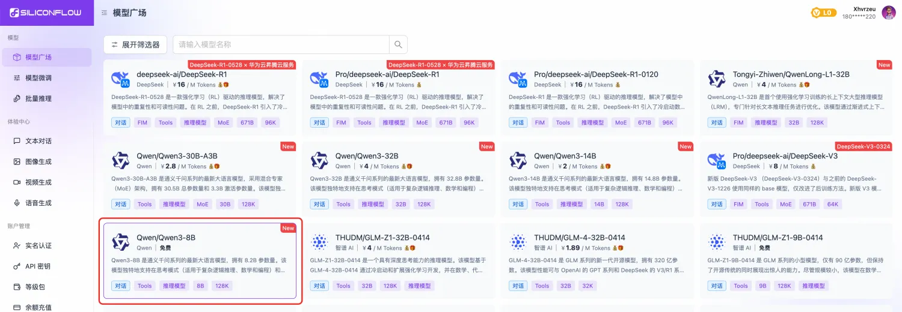
>
> 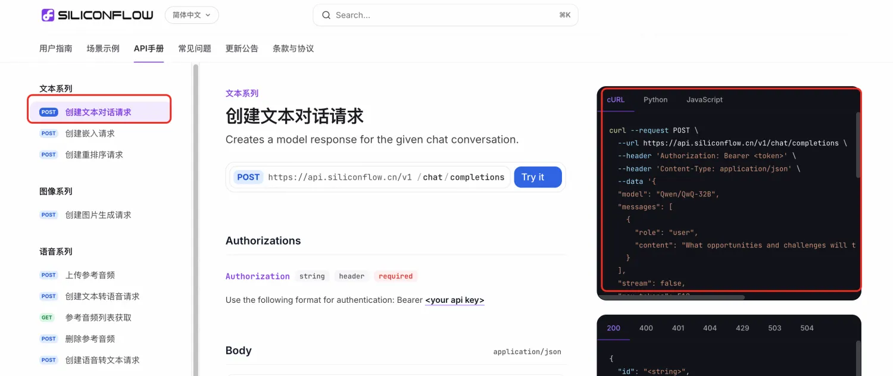
>

<h4 id="PI27G">同步配置</h4>
<font style="color:rgb(25, 27, 31);">在仓库目录下找到 .github/workflows/main.yml，修改同步配置：</font>

```yaml

name: CI

# Controls when the workflow will run
on:
  # Triggers the workflow on push or pull request events but only for the main branch
  push:
    branches: [ main ]
  pull_request:
    branches: [ main ]
  schedule:
    - cron: 0 15 * * *  # every 23:59 UTC +8

  # Allows you to run this workflow manually from the Actions tab
  workflow_dispatch:

# A workflow run is made up of one or more jobs that can run sequentially or in parallel
jobs:
  create-daily-news:
    runs-on: ubuntu-latest

    env:
      GIT_NAME: ${{ secrets.GIT_NAME }}
      GIT_EMAIL: ${{ secrets.GIT_EMAIL }}
      AI_PROVIDER: ${{ secrets.AI_PROVIDER }}
      GPT_MODEL_NAME: ${{ secrets.GPT_MODEL_NAME }}
      GPT_BASE_URL: ${{ secrets.GPT_BASE_URL }}
      GPT_API_KEY: ${{ secrets.GPT_API_KEY }}

    steps:
      - name: Checkout
        uses: actions/checkout@v2

      - name: Before Execute
        # You may pin to the exact commit or the version.
        run: |
          echo $GPT_API_KEY
          echo $AI_PROVIDER
          ls -l

      - name: Set up Python
        uses: actions/setup-python@v2
        with:
          python-version: '3.x'

      - name: Install requirements
        run: |
          python3 -m pip install --upgrade pip
          pip3 install -r ./requirements.txt

      - name: Create Daily News
        # You may pin to the exact commit or the version.
        run: python3 ./main.py

      - name: Get branch name
        run: echo "BRANCH_NAME=${GITHUB_REF#refs/heads/}" >> $GITHUB_ENV

      - name: Commit
        run: |
          git config --local user.name $GIT_NAME
          git config --local user.email $GIT_EMAIL
          git add .
          git commit -m "Github action update at `date '+%Y-%m-%d %H:%M:%S'`."

      - name: Push
        uses: ad-m/github-push-action@master
        if: ${{ env.BRANCH_NAME == 'main' }} # only for main
        with:
          github_token: ${{ secrets.ACCESS_TOKEN }}
          branch: main

```

<h4 id="LQuSS">部署 & 定时同步</h4>
使用 Vercel 部署（自定更换地址中的个人路径信息）：

[https://vercel.com/new/clone?repository-url=https%3A%2F%2Fgithub.com%2Fhellomypastor%2FAIDailyNews&teamSlug=hellomypastors-projects](https://vercel.com/new/clone?repository-url=https%3A%2F%2Fgithub.com%2Fhellomypastor%2FAIDailyNews&teamSlug=hellomypastors-projects)

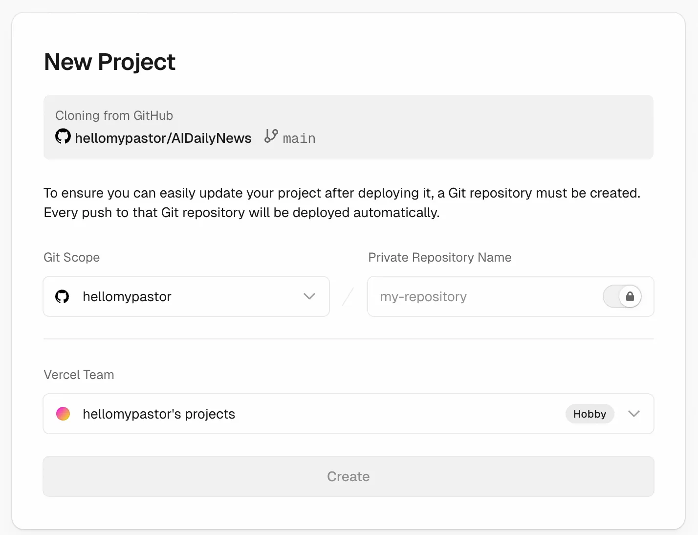

在 Vercel 中新增 Deploy Hooks：

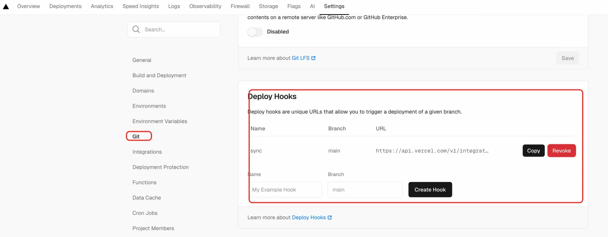

在仓库中配置 Webhooks：

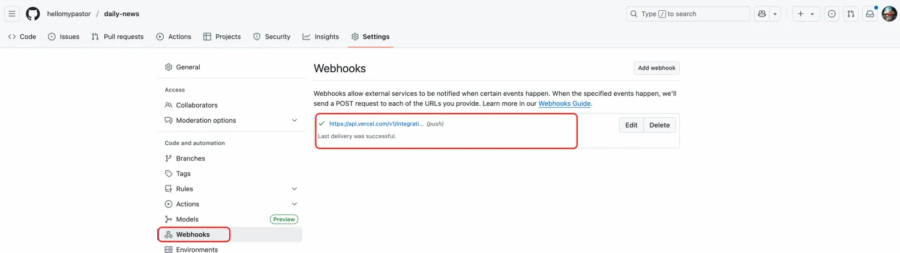

<font style="color:rgb(25, 27, 31);">为 GitHub Actions 添加代码提交权限，访问仓库的 Settings > Actions > General页面，找到 Workflow permissions 的设置项，将选项配置为 Read and write permissions，支持 CI 将数据更新后提交到仓库中</font>

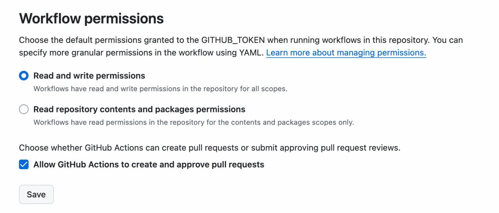

<font style="color:rgb(25, 27, 31);">访问仓库的 Settings > Security > Secrets and variables > Actions 页面，添加账号及密钥信息</font>

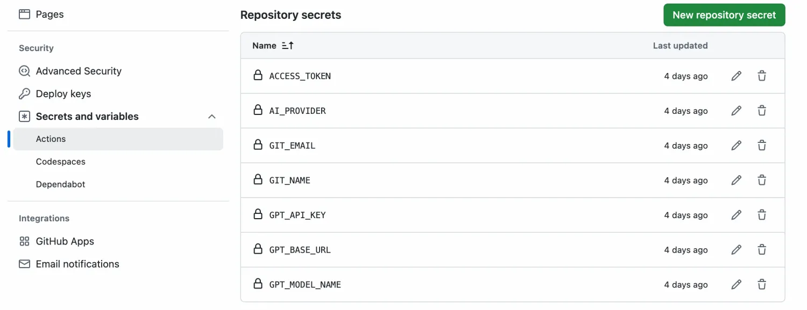

<h4 id="OtnTy">自定义域名</h4>
Vercel 提供了域名，但域名比较长，不易记住

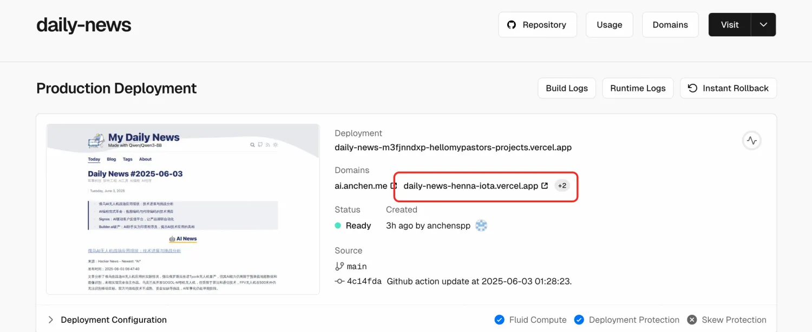

可以自定义域名：

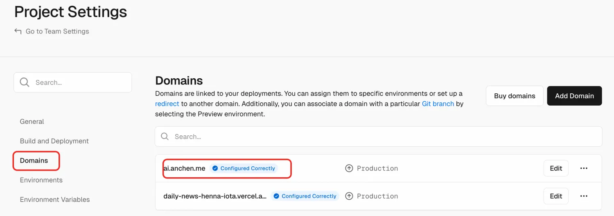

<h4 id="DvPwg">效果</h4>
Vercel 部署页面：

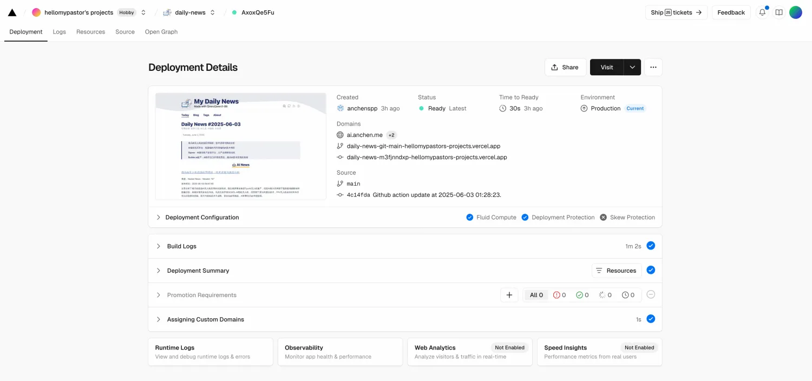

生成的新闻总览页面：

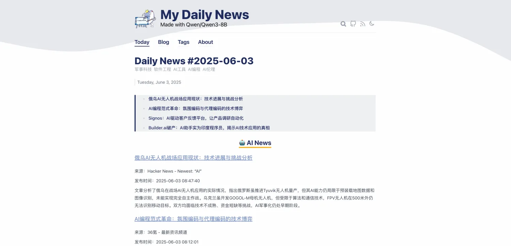

<h4 id="DvPwg">扩展</h4>
有一个 Chrome 插件，正好是做这个事情的，可以填自己的 API key 免费用，还支持配钉钉机器人定时推送：https://chromewebstore.google.com/detail/tidyread-read-more-in-les/gpfnpbpkadjgeoneammbiiidbkgkncaa
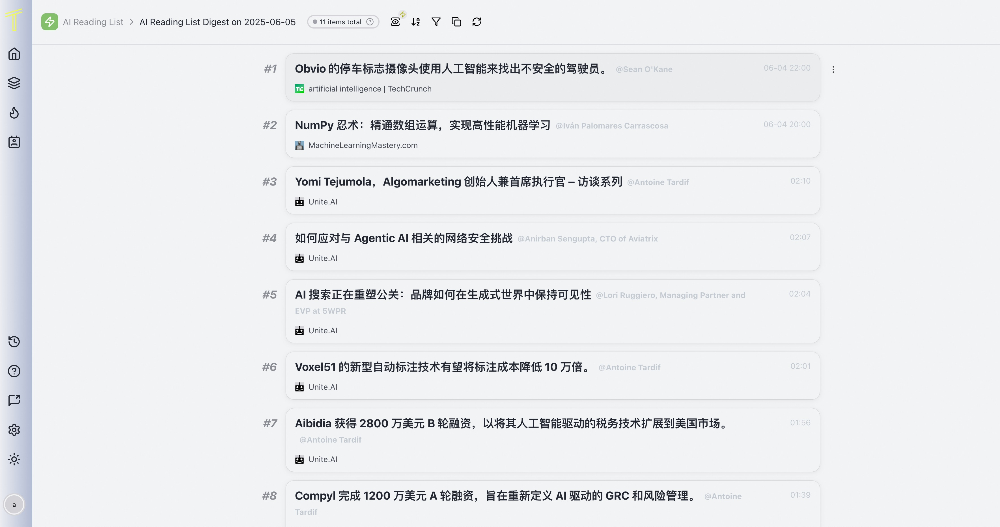

<h3 id="e5gcs">原理</h3>
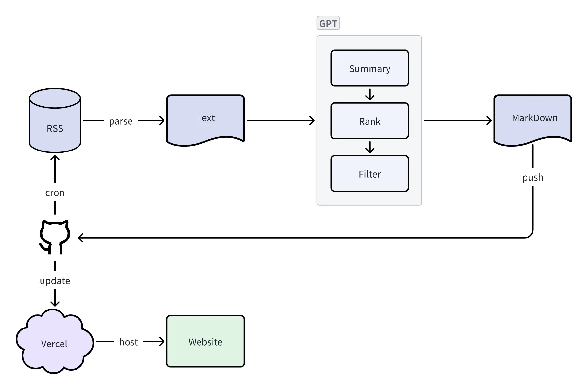

> 1. <font style="color:rgb(31, 35, 40);">GitHub Actions 自动从 RSS 采集数据</font>
> 2. <font style="color:rgb(25, 27, 31);">采集后的数据 输入给 AI，AI 进行分析总结后，生成 MarkDown 文档后，push 到仓库中</font>
> 3. <font style="color:rgb(31, 35, 40);">通过 Vercel 自动部署</font>
> 4. <font style="color:rgb(31, 35, 40);">支持 OpenAI、Gemini、Qwen3 等模型</font>
>

<h3 id="YL2kJ">写在最后</h3>
整个搭建过程差不多耗时 1 小时，除了部署的时候遇到了几个坑之外，其他都很顺利，有兴趣的同学可以试试。

让 AI 去帮我们分析总结 AI 相关的新闻，这件事在我看来还是很有趣很酷的。AI 时代，事情再难总有机会，不要怕，坚持下去，坚持到最后的胜利。

<h3 id="nwIXL">参考</h3>
【1】[https://github.com/zhangferry/AIDailyNews](https://github.com/zhangferry/AIDailyNews)

